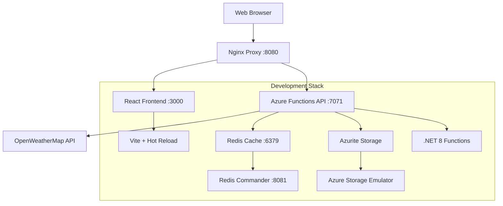

# 🌤️ SkySense - Weather Dashboard

> Real-time weather intelligence with beautiful visualizations and smart alerts

[](https://azure.microsoft.com/services/app-service/static/)
[](https://azure.microsoft.com/services/functions/)
[](https://dotnet.microsoft.com/)
[](https://reactjs.org/)
[](https://tailwindcss.com/)

## ✨ Features

🌍 **Global Weather Data** - Get real-time weather for any city worldwide  
📊 **Interactive Forecasts** - 7-day detailed forecasts with hourly breakdown  
⚡ **Smart Alerts** - Intelligent weather warnings and notifications  
📱 **Responsive Design** - Beautiful UI that works on all devices  
🎯 **Auto-Location** - Automatic weather detection for your current location  
💾 **Smart Caching** - Fast performance with Redis caching  
🔄 **Real-time Updates** - Live data refresh every 15 minutes  
🎨 **Dynamic Themes** - Weather-adaptive UI themes and animations  

## 🛠️ Tech Stack

### Frontend
- **React 18.3** - Modern UI framework with hooks
- **TypeScript 5.6** - Type-safe development
- **Tailwind CSS 3.4** - Utility-first styling
- **Alpine.js 3.14** - Lightweight interactivity
- **Vite 5.4** - Lightning-fast build tool
- **Lucide React** - Beautiful icon system

### Backend
- **.NET 8.0** - High-performance runtime
- **Azure Functions v4** - Serverless compute
- **OpenWeatherMap API** - Real-time weather data
- **Redis Cache** - High-speed data caching
- **Application Insights** - Performance monitoring

### Infrastructure
- **Azure Static Web Apps** - Frontend hosting
- **Azure Function Apps** - API backend
- **Azure Cache for Redis** - Data caching layer
- **GitHub Actions** - CI/CD pipeline

## 🏗️ Architecture



## 🚀 Quick Start

### Prerequisites

- **Docker** and **Docker Compose**
- **OpenWeatherMap API Key** ([Get free key here](https://openweathermap.org/api))

### Setup

1. **Clone and configure**
   ```bash
   git clone https://github.com/your-username/weather-dashboard.git
   cd weather-dashboard
   
   # Copy environment template
   cp .env.example .env
   
   # Edit .env and add your OpenWeatherMap API key
   nano .env  # or use your preferred editor
   ```

2. **Add your API key to .env**
   ```env
   OPENWEATHER_API_KEY=your_api_key_here
   ```

3. **Start everything with Docker**
   ```bash
   # Start all services
   docker-compose up -d
   
   # View logs (optional)
   docker-compose logs -f
   ```

4. **Access your application**
   - **🌐 Main App**: http://localhost:8080
   - **⚛️ Frontend Direct**: http://localhost:3000
   - **🔧 API Backend**: http://localhost:7071
   - **📋 Redis UI**: http://localhost:8081

## 🔧 Development URLs

| Service | URL | Description |
|---------|-----|-------------|
| **🌐 Main Application** | `http://localhost:8080` | Complete app via Nginx proxy |
| **⚛️ Frontend** | `http://localhost:3000` | React development server |
| **🔧 Backend API** | `http://localhost:7071` | Azure Functions API |
| **📋 Redis Commander** | `http://localhost:8081` | Redis management UI |
| **☁️ Azurite Storage** | `http://localhost:10000-10002` | Azure Storage emulator |

## ⚙️ Environment Configuration

### Main Configuration (.env)
```env
# OpenWeatherMap API (Required)
OPENWEATHER_API_KEY=your_api_key_here

# Application URLs
VITE_API_BASE_URL=http://localhost:7071/api
VITE_APP_NAME=Weather Dashboard

# Cache Configuration
CACHE_DURATION_MINUTES=15
FORECAST_CACHE_DURATION_MINUTES=60

# Redis Configuration
REDIS_PASSWORD=weather_redis_pass
REDIS_CONNECTION_STRING=redis:6379,password=weather_redis_pass

# Temperature Thresholds
HIGH_TEMPERATURE_THRESHOLD=35.0
LOW_TEMPERATURE_THRESHOLD=0.0
HIGH_WIND_SPEED_THRESHOLD=15.0

# Rate Limiting
RATE_LIMIT_MAX_REQUESTS=3
RATE_LIMIT_WINDOW_SECONDS=10
```

## 📁 Project Structure

```
weather-dashboard/
├── docker-compose.yml              # 🐳 Complete development stack
├── nginx.conf                      # 🌐 Proxy configuration
├── .env                            # ⚙️ Environment variables
├── apps/
│   ├── backend/                    # 🔧 .NET Azure Functions
│   │   ├── Dockerfile
│   │   └── src/WeatherDashboard.Functions/
│   └── frontend/                   # ⚛️ React + TypeScript + Vite
│       ├── Dockerfile
│       └── src/
└── docs/                           # 📖 Documentation
```

## 🌐 API Documentation

### Weather Endpoints

| Endpoint | Method | Description | Example |
|----------|--------|-------------|---------|
| `/api/weather/{city}` | GET | Current weather by city | `/api/weather/Lima` |
| `/api/weather-coords` | GET | Weather by coordinates | `/api/weather-coords?lat=-12.04&lon=-77.04` |
| `/api/forecast/{city}` | GET | 5-day forecast | `/api/forecast/Lima` |
| `/api/forecast-coords` | GET | Forecast by coordinates | `/api/forecast-coords?lat=-12.04&lon=-77.04` |
| `/api/alerts/{city}` | GET | Weather alerts | `/api/alerts/Lima` |
| `/api/health` | GET | API health check | `/api/health` |

### Quick API Test
```bash
# Test weather API
curl "http://localhost:8080/api/weather-coords?lat=-12.0464&lon=-77.0428&units=metric"

# Test health endpoint
curl "http://localhost:8080/api/health"
```

## 🛠️ Development Commands

### Docker Commands
```bash
# Start all services
docker-compose up -d

# View logs
docker-compose logs -f [service-name]

# Restart specific service
docker-compose restart [service-name]

# Stop all services
docker-compose down

# Rebuild and start
docker-compose up -d --build

# Clean everything (⚠️ removes data)
docker-compose down -v
```

### Service-Specific Development
```bash
# Frontend only (if you want to develop without Docker)
cd apps/frontend
npm install
npm run dev

# Backend only (if you want to develop without Docker)
cd apps/backend/src/WeatherDashboard.Functions
dotnet restore
func start
```

## 🚀 Deployment

Ready to deploy? Check our [deployment guide](docs/deployment.md) for Azure, AWS, or other cloud providers.

## 🧪 Testing

### Health Checks
```bash
# Test all services
curl http://localhost:8080/health        # Nginx
curl http://localhost:7071/api/health    # Backend
docker-compose exec redis redis-cli ping # Redis
curl http://localhost:10000              # Azurite
```

### Load Testing (Optional)
```bash
# Install k6
brew install k6  # macOS

# Run load test
k6 run tests/load-test.js
```

## 🔧 Troubleshooting

### Common Issues

**❌ Port conflicts**
```bash
# Check what's using ports
lsof -i :8080,:3000,:7071

# Change ports in .env if needed
```

**❌ API key not working**
```bash
# Verify API key
curl "https://api.openweathermap.org/data/2.5/weather?q=London&appid=YOUR_API_KEY"
```

**❌ Docker issues**
```bash
# Reset everything
docker-compose down -v
docker system prune -f
docker-compose up -d --build
```

### Debug Mode
```bash
# Enable verbose logging
docker-compose logs -f weather-backend
docker-compose logs -f weather-frontend
```

## 🤝 Contributing

1. Fork the repository
2. Create a feature branch: `git checkout -b feature/amazing-feature`
3. Make your changes
4. Test with Docker: `docker-compose up -d --build`
5. Commit: `git commit -m 'Add amazing feature'`
6. Push: `git push origin feature/amazing-feature`
7. Open a Pull Request

## 📄 License

This project is licensed under the MIT License - see the [LICENSE](LICENSE) file for details.

## 🙏 Acknowledgments

- [OpenWeatherMap](https://openweathermap.org/) for weather data
- [Docker](https://docker.com/) for containerization
- [Azure](https://azure.microsoft.com/) for cloud infrastructure
- [Tailwind CSS](https://tailwindcss.com/) for styling
- [Lucide](https://lucide.dev/) for icons

## 📞 Support

- 📧 **Email**: support@skysense.app
- 💬 **Issues**: [GitHub Issues](https://github.com/your-username/weather-dashboard/issues)
- 📖 **Docs**: [Documentation](https://docs.skysense.app)

---

<div align="center">
  <p>🐳 Powered by Docker • ⚛️ Built with React • ❤️ Made for Miguel Barreto</p>
  <p>⭐ Star this repo if you found it helpful!</p>
</div>